# Recebendo um XML e filtrando os dados com a função FILTER XPath

SAP BTP CPI - FILTER


## Filter dados no XML

Este iFlow foi desenvolvido no SAP BTP – Integration Suite (Cloud Integration) com o objetivo de filtrar e transformar os dados. dados para atender às necessidades do negócio.Aqui está um requisito real que abordamos recentemente no SAP CPI.

Visão geral dos requisitos:

Precisávamos:1️⃣ Classificar todos os dados dos funcionários que moram em SP. 


📊 Exemplo Prático do Fluxo

### Criando nosso Pacote


### Adicionando o nome para nosso Pacote
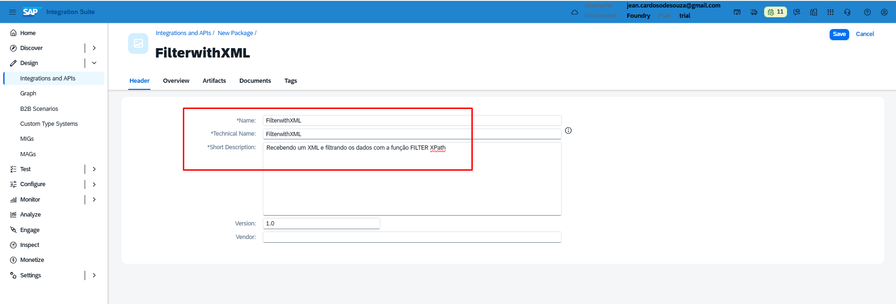

### Criando nosso Artefato do iFlow
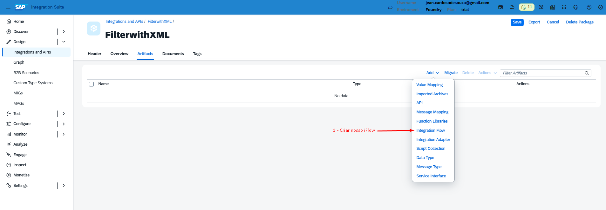

### Adicionando o Integration Flow
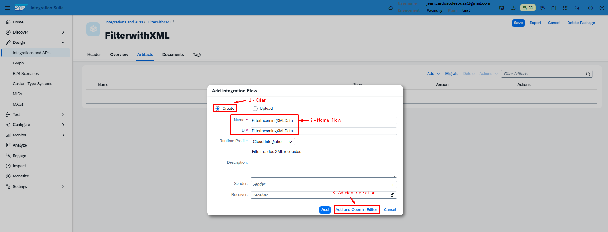

### Editando nosso Iflow
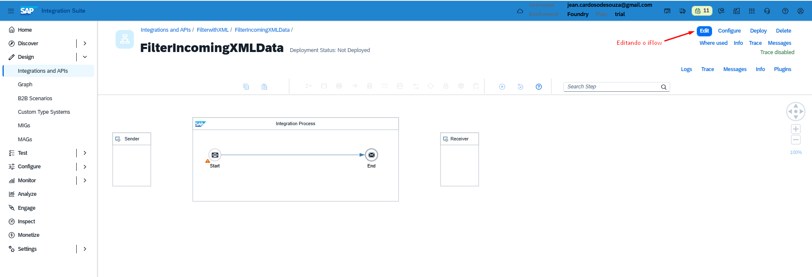

### Removendo o Sender do nosso iFlow
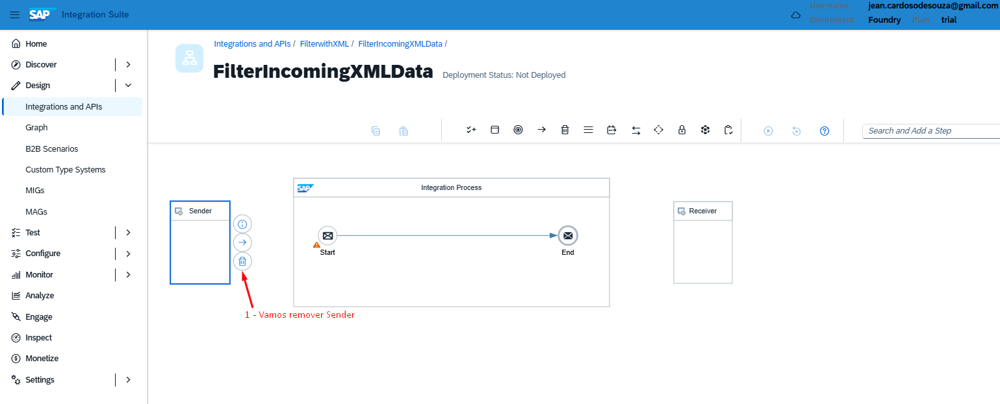

### Removendo o Receiver do nosso iFlow
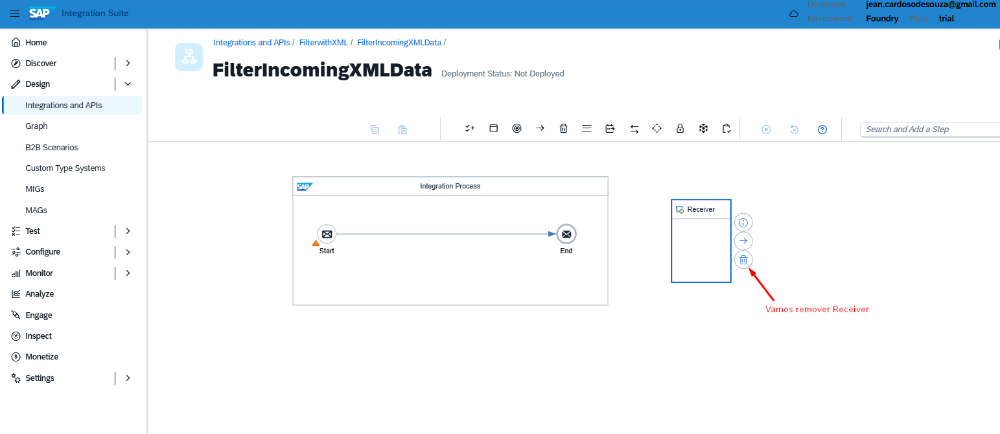

### Adicionando o Filter ao nosso Iflow
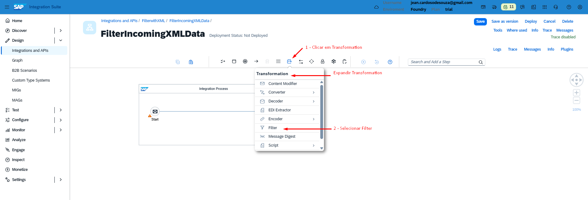

### Renomeando o Filter para Filter XML
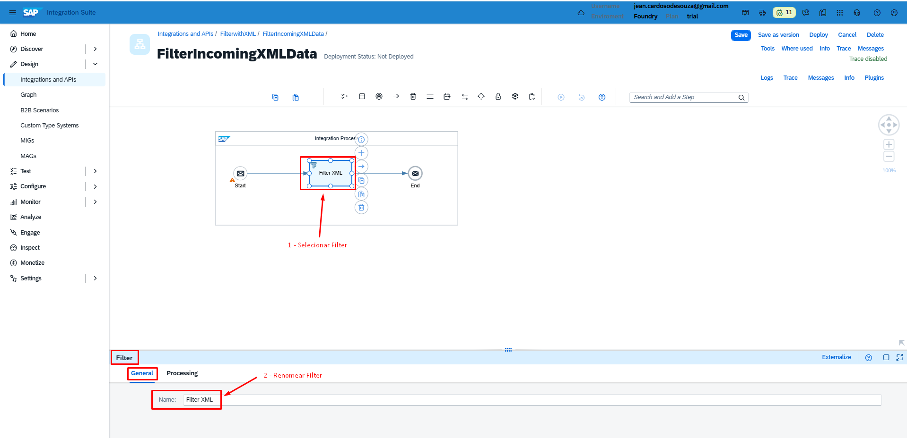

### Realizando o Filter 
Nesta etapa iremos colocar o caminho do XML que queremos filtrar

> Filter - Processing

```
XPath Expression: /empregados/empregado[estado = 'SP']
```
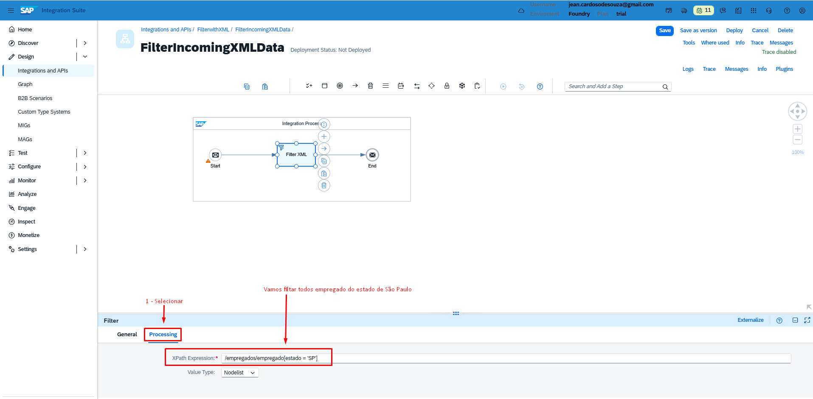

### Arquivo do empregados.xml

``` empregados.xml
<?xml version='1.0' encoding='UTF-8'?>
<empregados>
    <empregado>
        <idUsuario>1001</idUsuario>
        <dataInicio>2016-03-26</dataInicio>
        <dataFim>2099-03-26</dataFim>
        <nome>Kleber</nome>
        <sobrenome>Silva</sobrenome>
        <tipoEmprego>CLT</tipoEmprego>
        <pais>BR</pais>
        <estado>SP</estado>
    </empregado>
    <empregado>
        <idUsuario>1002</idUsuario>
        <dataInicio>2018-01-15</dataInicio>
        <dataFim>2099-01-15</dataFim>
        <nome>Ana</nome>
        <sobrenome>Santos</sobrenome>
        <tipoEmprego>CLT</tipoEmprego>
        <pais>BR</pais>
        <estado>RJ</estado>
    </empregado>
    <empregado>
        <idUsuario>1003</idUsuario>
        <dataInicio>2019-06-10</dataInicio>
        <dataFim>2099-06-10</dataFim>
        <nome>Carlos</nome>
        <sobrenome>Pereira</sobrenome>
        <tipoEmprego>EST</tipoEmprego>
        <pais>BR</pais>
        <estado>MG</estado>
    </empregado>
    <empregado>
        <idUsuario>1004</idUsuario>
        <dataInicio>2017-11-01</dataInicio>
        <dataFim>2099-11-01</dataFim>
        <nome>Mariana</nome>
        <sobrenome>Oliveira</sobrenome>
        <tipoEmprego>TER</tipoEmprego>
        <pais>BR</pais>
        <estado>PR</estado>
    </empregado>
    <empregado>
        <idUsuario>1005</idUsuario>
        <dataInicio>2020-02-20</dataInicio>
        <dataFim>2099-02-20</dataFim>
        <nome>Lucas</nome>
        <sobrenome>Costa</sobrenome>
        <tipoEmprego>TER</tipoEmprego>
        <pais>BR</pais>
        <estado>RS</estado>
    </empregado>
    <empregado>
        <idUsuario>1006</idUsuario>
        <dataInicio>2015-08-05</dataInicio>
        <dataFim>2099-08-05</dataFim>
        <nome>Fernanda</nome>
        <sobrenome>Lima</sobrenome>
        <tipoEmprego>APRE</tipoEmprego>
        <pais>BR</pais>
        <estado>BA</estado>
    </empregado>
    <empregado>
        <idUsuario>1007</idUsuario>
        <dataInicio>2021-04-12</dataInicio>
        <dataFim>2099-04-12</dataFim>
        <nome>Rafael</nome>
        <sobrenome>Almeida</sobrenome>
        <tipoEmprego>APRE</tipoEmprego>
        <pais>BR</pais>
        <estado>SC</estado>
    </empregado>
    <empregado>
        <idUsuario>1008</idUsuario>
        <dataInicio>2014-09-30</dataInicio>
        <dataFim>2099-09-30</dataFim>
        <nome>Patricia</nome>
        <sobrenome>Rocha</sobrenome>
        <tipoEmprego>TER</tipoEmprego>
        <pais>BR</pais>
        <estado>PE</estado>
    </empregado>
    <empregado>
        <idUsuario>1009</idUsuario>
        <dataInicio>2016-12-01</dataInicio>
        <dataFim>2099-12-01</dataFim>
        <nome>Bruno</nome>
        <sobrenome>Martins</sobrenome>
        <tipoEmprego>PJ</tipoEmprego>
        <pais>BR</pais>
        <estado>GO</estado>
    </empregado>
    <empregado>
        <idUsuario>1010</idUsuario>
        <dataInicio>2022-07-18</dataInicio>
        <dataFim>2099-07-18</dataFim>
        <nome>Juliana</nome>
        <sobrenome>Ferreira</sobrenome>
        <tipoEmprego>PJ</tipoEmprego>
        <pais>BR</pais>
        <estado>SP</estado>
    </empregado>
</empregados>

```


### Selecionando Conector
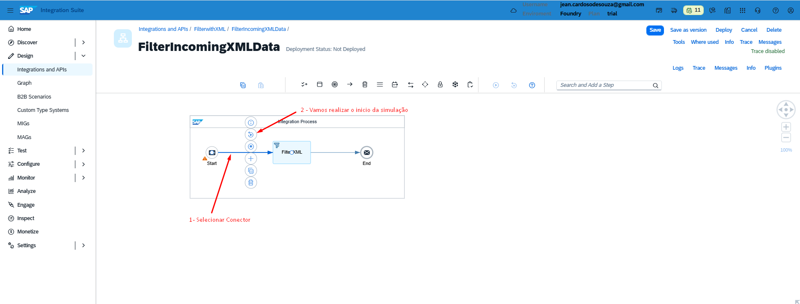

### Clicar no icone de iniciar Simulação
Para adicionar nosso XML
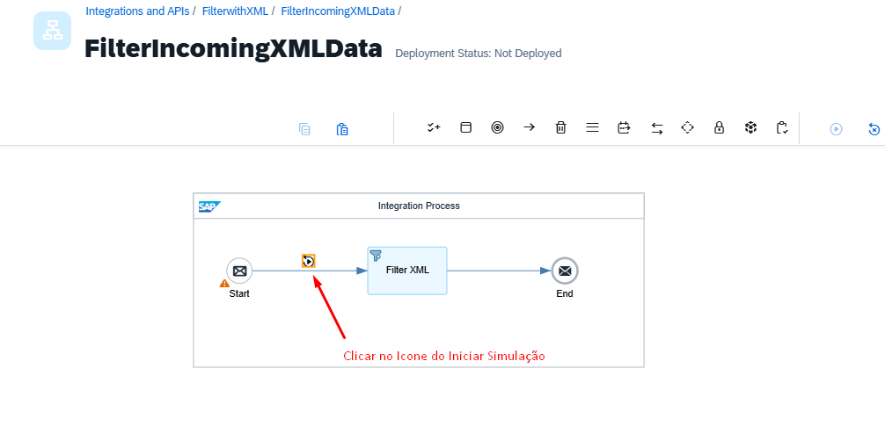

### Adicionando o conteúdo do empregados.xml
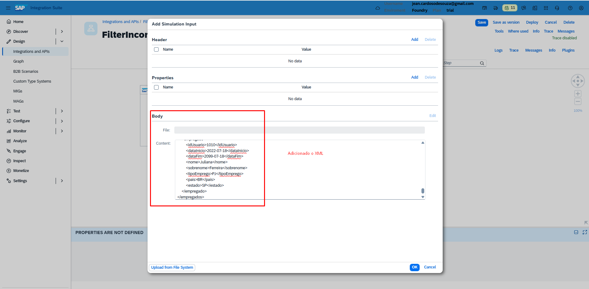

### Clicar no Conector e adicionar o End Simulação
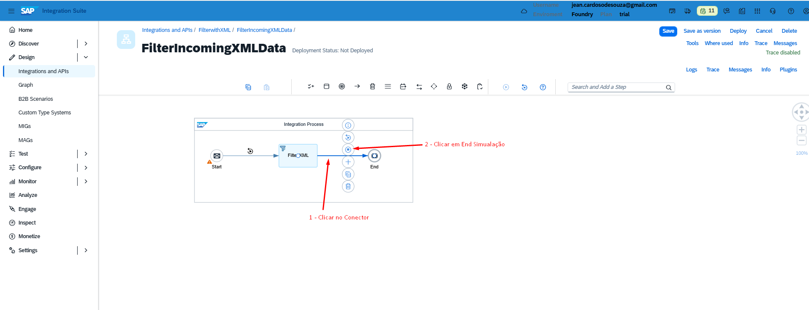

### Clicar para iniciar nossos teste de simulação
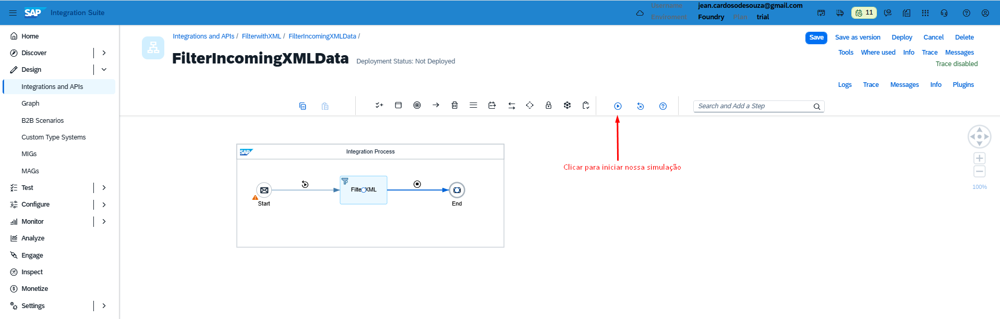

### Clicar no Envelope para ver o resultado
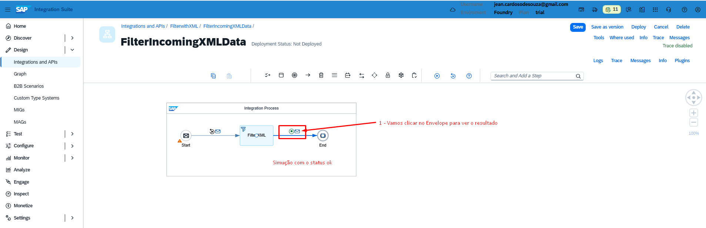

### Resultado com o filtro do XML
Com todos os dados que são do estado de SP
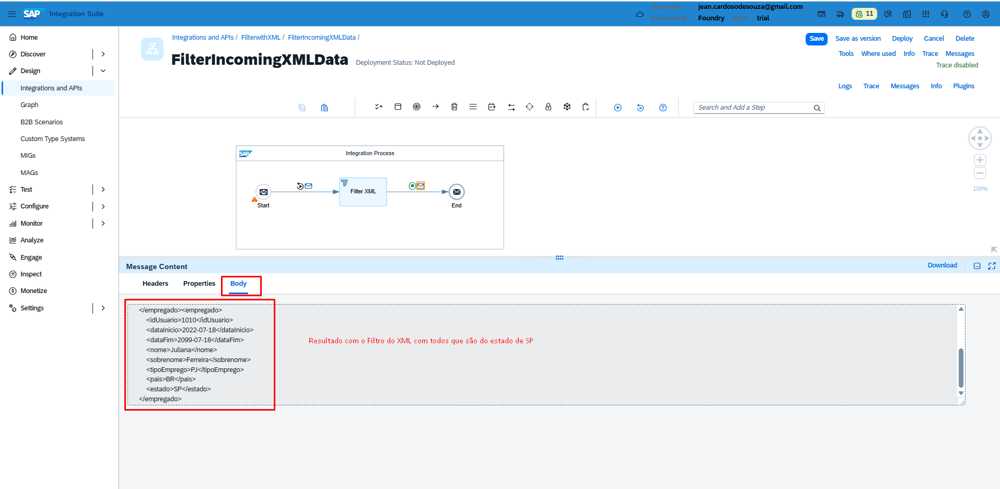

### XML do resultado
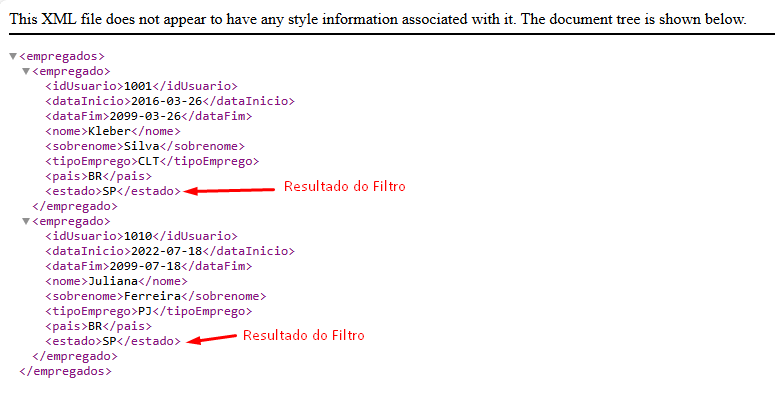

``` Resultado do Filtro de SP
<?xml version='1.0' encoding='UTF-8'?>
<empregados>
    <empregado>
        <idUsuario>1001</idUsuario>
        <dataInicio>2016-03-26</dataInicio>
        <dataFim>2099-03-26</dataFim>
        <nome>Kleber</nome>
        <sobrenome>Silva</sobrenome>
        <tipoEmprego>CLT</tipoEmprego>
        <pais>BR</pais>
        <estado>SP</estado>
    </empregado>
    <empregado>
        <idUsuario>1010</idUsuario>
        <dataInicio>2022-07-18</dataInicio>
        <dataFim>2099-07-18</dataFim>
        <nome>Juliana</nome>
        <sobrenome>Ferreira</sobrenome>
        <tipoEmprego>PJ</tipoEmprego>
        <pais>BR</pais>
        <estado>SP</estado>
    </empregado>
</empregados>
```


## 📦 Exemplo prático – iFlow para baixar

📦 [Download do iFlow – Package/FilterwithXML.zip](Package/FilterwithXML.zip)


> O arquivo pode ser importado diretamente no SAP Integration Suite (CPI).
